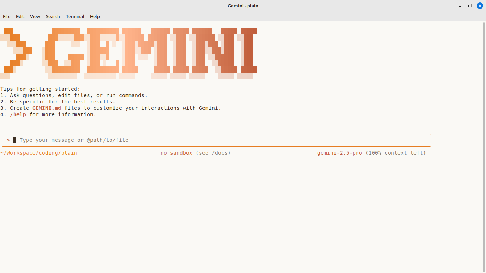
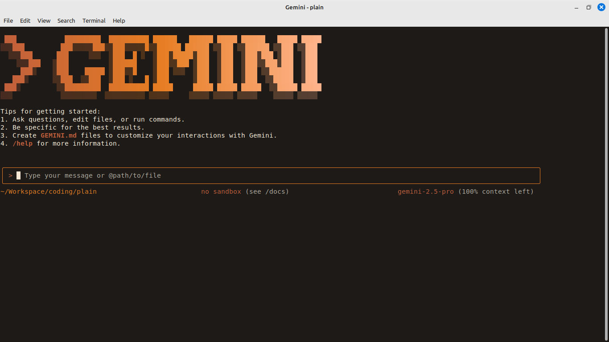

# 📜 Claude Code–Inspired Themes for the Gemini CLI

A warm, analog-inspired theme pack for the [Gemini CLI](https://github.com/microsoft/gemini-cli), featuring both **light** and **dark** themes based on the editorial aesthetic of Claude Code. Includes matching **terminal color presets** for a cohesive, parchment-toned experience across shell and CLI.

> _Inspired by the visual style of Claude Code, these themes offer a curated palette of warm, analog tones designed to evoke a thoughtful, editorial aesthetic. It is not affiliated with or endorsed by Anthropic._

---

## 🎨 What's Included

- ✅ **Light and Dark Gemini CLI themes**  
  Designed for readability, warmth, and minimal contrast.

- ✅ **Terminal color presets**  
  Matching foreground, background, cursor, and accent colors for popular terminal emulators.

---

## ⚙️ Installation

To use these themes:

1. Open Gemini CLI `settings.json` file, typically located at:

```bash
~/.gemini/settings.json
```

2. Copy the contents of `claude-code-like-light.json` or `claude-code-like-dark.json` into the `customThemes` section under the `ui` key in `settings.json`. All fields are decribed [here](./gemini-cli-theme-json-fields.md).

3. Set the "theme" value to match the theme name (e.g., "claude-code-like-light").

4. Save the file and restart Gemini CLI to apply the changes.

5. The themes could be switched interactively using the `/theme` slash command in a running Gemini CLI session.

6. Update the [terminal colors](./terminal-colors.md) to match the theme for a consistent look across shell and CLI.

### `settings.json`

```json
{
  "ui": {
    "customThemes": {
      "claude-code-like-light": {
        "name": "claude-code-like-light",
        "type": "custom",
        "Background": "#FAF9F5",
        "Foreground": "#3C2F23",
        "LightBlue": "#FFA45C",
        "AccentBlue": "#E67D22",
        "AccentPurple": "#C15F3C",
        "AccentCyan": "#B1ADA1",
        "AccentGreen": "#D6D3C9",
        "AccentYellow": "#FFB38A",
        "AccentRed": "#C15F3C",
        "Comment": "#B1ADA1",
        "Gray": "#847A6D",
        "DiffAdded": "#A6E3A1",
        "DiffRemoved": "#F38BA8",
        "GradientColors": [
          "#E67D22",
          "#FFB38A",
          "#C15F3C"
        ]
      },
      "claude-code-like-dark": {
        "name": "claude-code-like-dark",
        "type": "custom",
        "Background": "#1E1A17",
        "Foreground": "#FFF5E1",
        "LightBlue": "#FFA45C",
        "AccentBlue": "#E67D22",
        "AccentPurple": "#C15F3C",
        "AccentCyan": "#B1ADA1",
        "AccentGreen": "#D6D3C9",
        "AccentYellow": "#FFB38A",
        "AccentRed": "#C15F3C",
        "Comment": "#847A6D",
        "Gray": "#B1ADA1",
        "DiffAdded": "#417D3C",
        "DiffRemoved": "#6E0321",
        "GradientColors": [
          "#C15F3C",
          "#E67D22",
          "#FFB38A"
        ]
      }
    },
    "theme": "claude-code-like-light"
  }
}
```

### Light Theme



### Dark Theme


